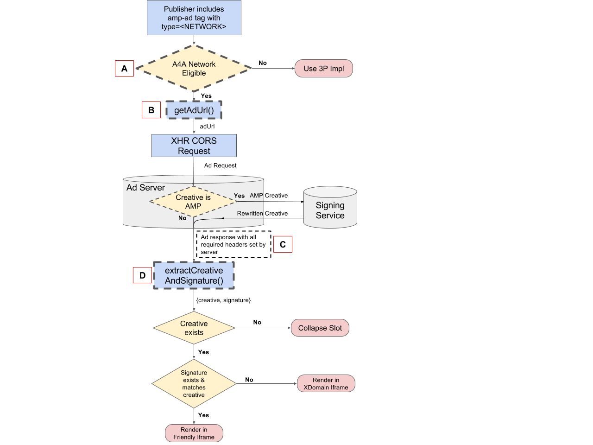
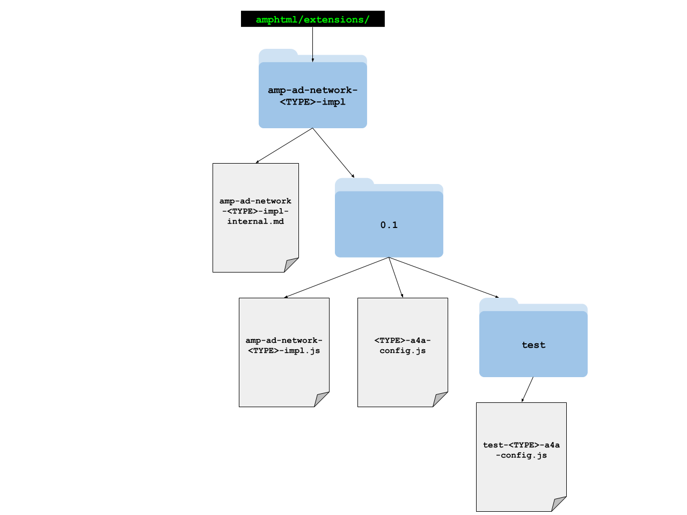

# Fast Fetch Network Implementation Guide

*Status: Draft*

*Authors: [kjwright@google.com](mailto:kjwright@google.com), [bradfrizzell@google.com](mailto:bradfrizzell@google.com)*

*Last Updated: 1-27-2016*


# Objective

Outline requirements and steps for ad network to implement Fast Fetch for early ad request and support for AMP Ads returned by the ad network to be given preferential rendering. 

# Background

Relevant design documents:  [A4A Format Guide](https://github.com/ampproject/amphtml/blob/master/extensions/amp-a4a/amp-a4a-format.md) & [intent to implement](https://github.com/ampproject/amphtml/issues/3133).

If you haven’t already, please read the A4A Readme to learn about why all networks should implement Fast Fetch. 

# Overview

Fast Fetch provides preferential treatment to Verified AMP Ads over Legacy Ads, unlike the current 3P rendering flow which treats AMP Ads and Legacy Ads the same. Within Fast Fetch, if an ad fails validation, that ad is wrapped in a cross-domain iframe to sandbox it from the rest of the AMP document. Conversely, an AMP Ad passing validation is written directly into the page. Fast Fetch handles both AMP and non-AMP ads; no additional ad requests are required for ads that fail validation.  

In order to support Fast Fetch, ad networks will be required to implement the following:

* [XHR CORS](https://www.w3.org/TR/cors/) for the ad request

* The Javascript to build the ad request must be located within the AMP HTML github repository (example implementations: [AdSense](https://github.com/ampproject/amphtml/tree/master/extensions/amp-ad-network-adsense-impl) & [Doubleclick](https://github.com/ampproject/amphtml/tree/master/extensions/amp-ad-network-doubleclick-impl)).

# Detailed Design


Figure 1: Fast Fetch Rendering Flow


## Ad server requirements

### SSL

All network communication via the AMP HTML runtime (resources or XHR) require SSL.

### AMP Ad Creative Signature

In order for the AMP runtime to know that a creative is valid [AMP](https://github.com/ampproject/amphtml/blob/master/extensions/amp-a4a/amp-a4a-format.md), and thus receive preferential ad rendering, it must pass a client-side, validation check.  The creative must be sent by the ad network to a validation service which verifies the creative conforms to the [specification](https://github.com/ampproject/amphtml/blob/master/extensions/amp-a4a/amp-a4a-format.md).  If so, it will be rewritten by the validation service and the rewritten creative and a cryptographic signature will be returned to the ad network.  The rewritten creative and signature must be included in the response to the AMP runtime from the ad network. extractCreativeAndSignature will then parse out the creative and the signature from the ad response.  Lack of, or invalid signature will cause the runtime to treat it as a Legacy Ad, rendering it within a cross domain iframe and using delayed ad rendering.

### Ad Response Headers

*See Figure 1 above, Part C*

Fast Fetch requires that the ad request be sent via [XHR CORS](https://www.w3.org/TR/cors/) as this allows for direct communication with the ad network without the possibility of custom javascript execution (e.g. iframe or JSONP).  XHR CORS requires a preflight request where the response needs to indicate if the request is allowed by including the following headers in the response::

* "Access-Control-Allow-Origin" with value matching the value of the request "Origin" header only if the origin domain is allowed ("Note that requests from pages hosted on the Google AMP Cache will have a value matching the domain [https://cdn.ampproject.org](https://cdn.ampproject.org)").

* "AMP-Access-Control-Allow-Source-Origin" with value matching the value of the request parameter "__amp_source_origin" which is [added](https://github.com/ampproject/amphtml/blob/master/src/service/xhr-impl.js#L103) by the AMP HTML runtime and matches the origin of the request had the page not been served from [Google AMP Cache](https://www.ampproject.org/docs/get_started/about-amp.html) (the originating source of the page).  Ad network can use this to prevent access by particular publisher domains where lack of response header will cause the response to be [dropped](https://github.com/ampproject/amphtml/blob/master/src/service/xhr-impl.js#L137) by the AMP HTML runtime.

* "Access-Control-Allow-Credentials" with value "true" if cookies should be included in the request.

* "Access-Control-Expose-Headers" with value matching comma separated list any non-standard response headers included in the response.  At a minimum, this should include "AMP-Access-Control-Allow-Source-Origin".  If other custom headers are not included, they will be dropped by the browser.

## A4A Extension Implementation

The [AMP Ad](https://github.com/ampproject/amphtml/blob/master/extensions/amp-ad/amp-ad.md) element differentiates between different ad network implementations via the type attribute, e.g. the following amp-ad will utilize DoubleClick: 

  <amp-ad width=320 height=50 **type****=****"doubleclick"** data-slot="/43821041/mobile_ad_banner">

To create an ad network implementation, the following steps must be taken:

Create a new extension within the extensions section in the AMP HTML Github [repository](https://github.com/ampproject/amphtml) whose path and name match the type attribute given for amp ad element as follows: 


Figure 2: A4A Extension File Hierarchy


Ad networks that want to add support for Fast Fetch within AMP must add the file hierarchy as seen in Figure 2 to the AMP repository, with `<TYPE>` replaced by their own network. Files must implement all requirements as specified below. Anything not specified, i.e. helper functions etc are at the discretion of the ad network, but must be approved by AMP project members just as any other contributions.

### `amp-ad-network-<TYPE>-impl.js`

*See Figure 1 Parts B and D*

Implement class `AmpAdNetwork<TYPE>Impl`. This class must extend [AmpA4A](https://github.com/ampproject/amphtml/blob/master/extensions/amp-a4a/0.1/amp-a4a.js). This class must overwrite the super class methods **getAdUrl()** and **extractCreativeAndSignature()**.


``` javascript
getAdUrl() - must construct and return the ad url for ad request.
  // @return {string} - the ad url
```

``` javascript
extractCreativeAndSignature(responseText, responseHeaders)
  // @param {!ArrayBuffer} responseText Response body from the ad request.
  // @param {!Headers} responseHeaders Response headers from the ad request
  // @return {Object} creativeParts Object must have a .creative and a .signature.
``` 


Examples of network implementations can be seen for [DoubleClick](https://github.com/ampproject/amphtml/blob/master/extensions/amp-ad-network-doubleclick-impl/0.1/amp-ad-network-doubleclick-impl.js) and [AdSense](https://github.com/ampproject/amphtml/blob/master/extensions/amp-ad-network-adsense-impl/0.1/amp-ad-network-adsense-impl.js). 

Usage of getAdUrl and extractCreativeAndSignature can be seen within the this.adPromise_ promise chain in [amp-a4a.js](https://github.com/ampproject/amphtml/blob/master/extensions/amp-a4a/0.1/amp-a4a.js)

### `<TYPE>-a4a-config.js`

*See Figure 1: Part A*

Must implement and export following function. 

``` javascript
<TYPE>IsA4AEnabled(win, element)
  // @param (Window) win Window where AMP runtime is running.
  // @param (HTML Element) element ****The amp-ad element.
  // @return (boolean) Whether or not A4A should be used in this context. 
```

Once this file is implemented, [amphtml/ads/_a4a-config.js](https://github.com/ampproject/amphtml/blob/master/ads/_a4a-config.js) must also be updated. Specifically, `<TYPE>IsA4AEnabled()` must be imported, and it must be mapped to the ad network type in the a4aRegistry mapping. 

``` javascript
/**amphtml/ads/_a4a-config.js */
…
import {
  <TYPE>IsA4AEnabled
} from ‘../extensions/amp-ad-<TYPE>-impl/0.1/<TYPE>-a4a-config’; 
…
export const a4aRegistry = map({
  …
  ‘<TYPE>’: <TYPE>IsA4AEnabled,
  …
});
```

Example configs for [DoubleClick](https://github.com/ampproject/amphtml/blob/master/extensions/amp-ad-network-doubleclick-impl/0.1/doubleclick-a4a-config.js#L80) and [AdSense](https://github.com/ampproject/amphtml/blob/master/extensions/amp-ad-network-adsense-impl/0.1/adsense-a4a-config.js#L68)

Usage of DoubleClick and AdSense configs can be seen in [_a4a-config.js](https://github.com/ampproject/amphtml/blob/master/ads/_a4a-config.js)

### `amp-ad-network-<TYPE>-impl-internal.md`

Documentation for ad network amp-ad type. Please thoroughly document the usage of your implementation. 

Examples can be seen for [DoubleClick](https://github.com/ampproject/amphtml/blob/master/extensions/amp-ad-network-doubleclick-impl/amp-ad-network-doubleclick-impl-internal.md) and [AdSense](https://github.com/ampproject/amphtml/blob/master/extensions/amp-ad-network-adsense-impl/amp-ad-network-adsense-impl-internal.md).

### `test-amp-ad-network-<TYPE>-impl.js`

Please write thorough testing for your AMP ad network implementation. 

## Ad Network Checklist

* All Server-AMP communication done with SSL

* AMP Ads sent to Validation server

* Validated AMP Ads sent from network to AMP with signature

* Validated AMP Ads sent from network to AMP with appropriate headers

* File hierarchy created within amphtml/extensions

* Custom `amp-ad-network-<TYPE>-impl.js` overwrites getAdUrl()

* Custom `amp-ad-network-<TYPE>-impl.js` overwrites extractCreativeAndSignature()

* `<TYPE>-a4a-config.js` implements <TYPE>IsA4AEnabled()

* Mapping added for ad network to a4aRegistry map within _a4a-config.js

* Documentation written in `amp-ad-network-<TYPE>-impl-internal.md`

* Tests written in `test-amp-ad-network-<TYPE>-impl.js`

* Pull request merged to master 
